# 🛡️ Proyecto: Aplicación de Seguridad Urbana para Mujeres

## 1. Introducción y Propósito
La funcionalidad principal de esta aplicación es garantizar que las mujeres que caminen solas por la calle, especialmente de noche, se sientan más seguras. Mediante una interfaz basada en mapas (tipo Google Maps), la usuaria podrá indicar su punto de origen y destino a pie.

> **Distribución Restringida:** Esta aplicación no estará disponible para su descarga pública general. Será distribuida e instalada exclusivamente a través de entidades oficiales, como ayuntamientos y gobiernos locales, para garantizar la integridad de la red de usuarias.

---

## 2. Privacidad y Gestión de Datos
La privacidad y el anonimato son los pilares fundamentales de la arquitectura del sistema.

*   **Anonimato en la Red:** La aplicación no contendrá ningún dato personal de las usuarias. El sistema funcionará mediante un código único. El ayuntamiento será el único ente con capacidad para vincular dicho código a la identidad real de la persona; el servidor de la aplicación operará exclusivamente con códigos.
*   **Gestión Efímera de Trayectos:** Los datos del trayecto se eliminarán automáticamente en cuanto este finalice.
*   **Excepción por Denuncia:** Dado que existe la posibilidad de interactuar por chat con otras usuarias, si al finalizar un trayecto alguien reporta contenido inapropiado, los datos no se borrarán. Se enviarán al organismo oficial para su evaluación.
*   **Modo Camuflaje (Incógnito):** Para evitar que un agresor sepa que se está usando una app de seguridad, la interfaz principal puede adoptar la apariencia de otra aplicación (ej. reproductor de música, calculadora o noticias). Las funciones de emergencia se activarían mediante gestos ocultos (ej. deslizar dos dedos).
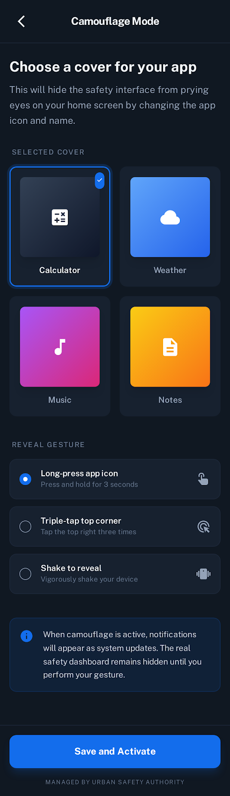
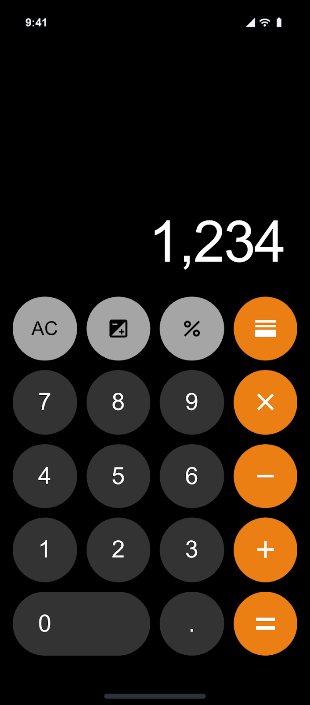

---

## 3. Funcionalidades durante el Trayecto (Prevención y Seguridad Pasiva)

### 🗺️ Rutas y Navegación
*   **Rutas "Seguras" vs. Rápidas:** En lugar de priorizar la ruta más corta, la app sugerirá una "Ruta Segura". Basándose en datos del ayuntamiento, priorizará calles bien iluminadas, zonas con cámaras de seguridad y vías principales.
*   **Aviso Automático de Llegada:** La gestión de contactos se realiza localmente en el teléfono. Al llegar al destino, el dispositivo enviará automáticamente un SMS (sin pasar por el servidor central) a los familiares configurados indicando: *"He llegado bien"*.

### 🤝 Comunidad y Acompañamiento
*   **Red de Apoyo Cercana:** Al iniciar un trayecto, la app avisa a usuarias cercanas por si desean acompañar a la usuaria, llamarla o enviarle un mensaje para que se sienta segura.
*   **Encuentros Físicos Voluntarios:** Si dos usuarias tienen un recorrido común, la app les preguntará a ambas si desean ser presentadas para caminar juntas. Si ambas aceptan, se las pondrá en contacto. Si alguna rechaza, la presentación se omite.
*   **Validación de Identidad (Anti-Suplantación):** Para asegurar que la persona que se acerca es la usuaria correcta y no un intruso, al acordar un encuentro, ambas pantallas mostrarán un color específico o una palabra clave aleatoria (ej. "Manzana") que servirá como santo y seña.

### ⚠️ Prevención Activa
*   **Alerta de Desviación (Modo Monitor):** Si el GPS detecta un desvío drástico, una detención inusual o un cambio brusco de velocidad, la app lanzará un aviso en pantalla: *"¿Estás bien?"*. Si no hay respuesta en 15 segundos, se activa la secuencia de Pánico.
*   **Modo "Llamada Falsa":** Botón discreto que simula una llamada entrante realista (con voz grabada y pausas) de un familiar. Funciona como elemento disuasorio ante la sospecha de ser seguida.
*   **Puntos Refugio (Safe Havens):** El mapa mostrará comercios locales adheridos (farmacias 24h, gasolineras, bares) donde el personal está formado por el ayuntamiento para ofrecer auxilio.

---

## 4. Sistema de Emergencias: El Botón del Pánico

La aplicación cuenta con un botón de gran tamaño diseñado para ser utilizado en situaciones de miedo, acoso o seguimiento.

### ⏳ Secuencia de Activación
Al pulsarlo, se inicia una cuenta atrás de **10 segundos de cortesía**. Esto permite cancelar la alerta en caso de pulsación accidental, evitando falsas alarmas. Si no se detiene, la alarma se emite automáticamente.

**Destinatarios de la Alarma:**
1. Usuarias que se encuentren cerca.
2. Organismos oficiales correspondientes.
3. Cuerpos de Policía.
4. Familiares de la usuaria.

### 🚨 Modos de Activación Avanzados
*   **Botón de "Hombre Muerto" (Alta Tensión):** Al atravesar una zona percibida como peligrosa, la usuaria puede caminar manteniendo el dedo presionado en la pantalla. Si suelta el dispositivo (por ejemplo, en un forcejeo), se solicita un PIN. Si no se introduce en 5 segundos, salta la alarma.
*   **Activación por Hardware:** Posibilidad de lanzar la alerta sin mirar la pantalla, ya sea pulsando repetidamente (ej. 5 veces) el botón físico de encendido o agitando violentamente el dispositivo desde el bolsillo.
*   **Grabación A\V Cifrada Automática:** Tras los 10 segundos de cortesía del botón del pánico, el micrófono y la cámara comenzarán a grabar. **Por privacidad:** Este archivo se cifra en el acto y se envía *exclusivamente* al servidor policial/oficial. Ni siquiera la propia usuaria podrá reproducirlo.

---

## 5. Participación Ciudadana y Urbanismo

*   **Mapas de Calor Anónimos:** Al finalizar un trayecto con éxito, la app preguntará por la percepción de seguridad. La usuaria podrá marcar puntos en el mapa reportando *"Poca iluminación"* o *"Presencia intimidatoria"*. Estos datos viajarán 100% anonimizados al ayuntamiento para optimizar el envío de patrullas o el mantenimiento del mobiliario urbano.

---

## 📊 Resumen del Flujo del Sistema y Privacidad

Para garantizar un ecosistema seguro y privado, las responsabilidades se dividen de la siguiente manera:

1. **Servidor del Ayuntamiento:** 
   * Solo visualiza **códigos de usuario**, coordenadas temporales, alertas de pánico y reportes de urbanismo totalmente anónimos.
2. **Dispositivo de la Usuaria (Local):** 
   * Guarda temporalmente la ruta, ejecuta las validaciones (como desvíos de mapa) y gestiona el envío de SMS a familiares. De este modo, el servidor central *nunca* tiene acceso a la agenda de contactos ni al nombre real de la mujer.

   ---

# 📱 Mapa de Pantallas (Wireframes / Vistas de la App)

## 1. Acceso y Configuración Inicial (Onboarding)
*Dado que es una app institucional de acceso restringido, no hay pantalla de "Registro", solo de acceso y configuración.*

*   **1.1. Pantalla de Bienvenida (Splash Screen):** Logos del Ayuntamiento/Entidad oficial y de la aplicación.
*   **1.2. Pantalla de Acceso (Login):** Único campo para introducir el **Código de Usuaria** proporcionado por el ayuntamiento. Botón de "Entrar".
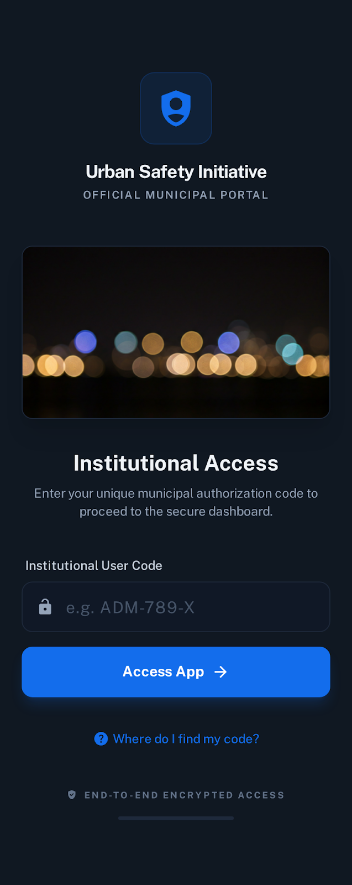
*   **1.3. Configuración de Contactos de Emergencia (Local):** Formulario para añadir teléfonos de "Familiares" a los que se avisará por SMS (guardados solo en el móvil).
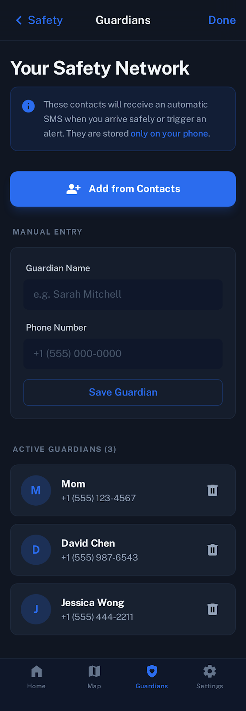
*   **1.4. Configuración de PIN de Seguridad:** Creación de un PIN de 4-6 dígitos necesario para cancelar falsas alarmas.
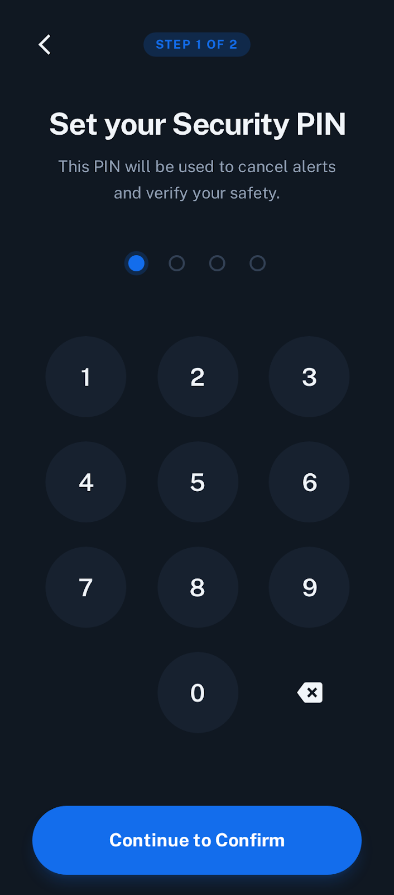
*   **1.5. Tutorial Rápido:** Breve explicación de los gestos ocultos, activación por botón físico y el funcionamiento de la privacidad.
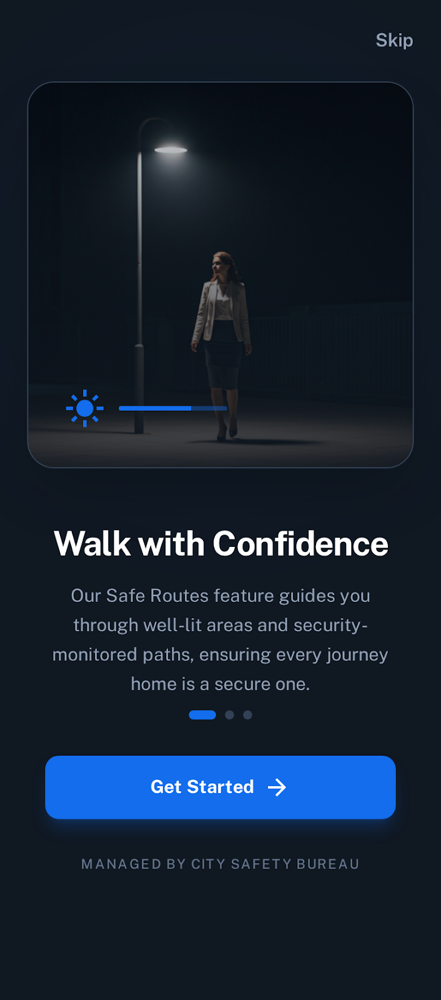
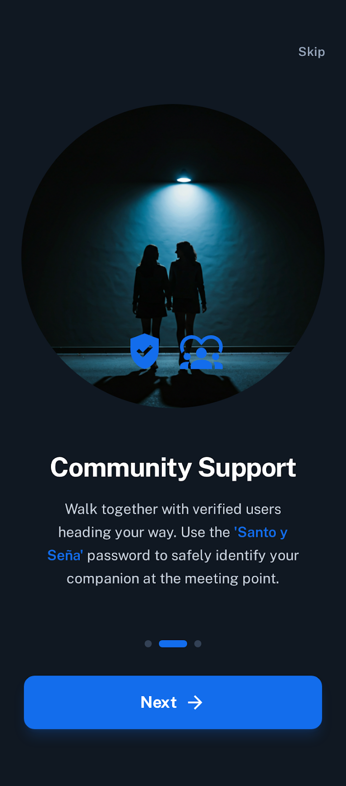
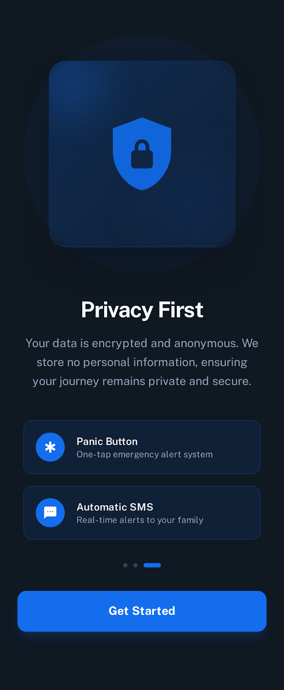
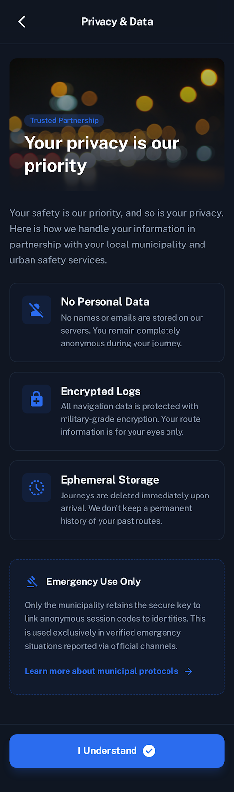

## 2. Planificación del Trayecto
*   **2.1. Pantalla Principal (Mapa de Inicio):** 
    *   Mapa tipo Google Maps centrado en la ubicación actual.
    *   Buscador para introducir el destino.
    *   Iconos visibles en el mapa indicando **Puntos Refugio** (farmacias, gasolineras, etc.).
    *   Botón de acceso rápido al "Botón del Pánico" siempre visible.
    *   Botón\Gesto para activar el **Modo Camuflaje**.
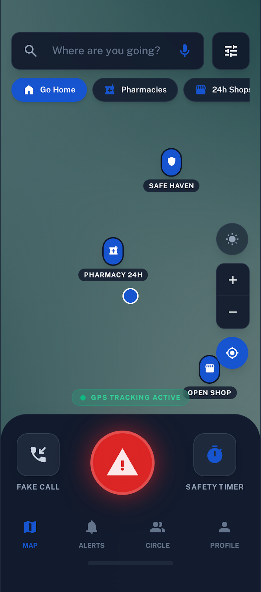
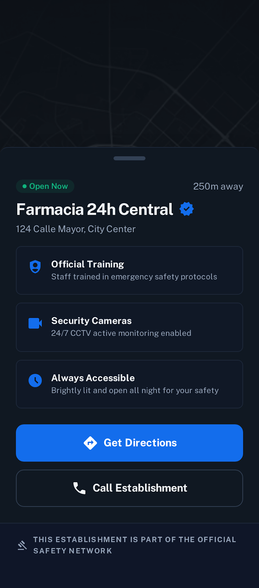
*   **2.2. Selector de Ruta:**
    *   Muestra dos opciones trazadas en el mapa con tiempo estimado: **"Ruta Segura"** (destacada) y **"Ruta Rápida"**.
    *   Botón grande: "Iniciar Trayecto".
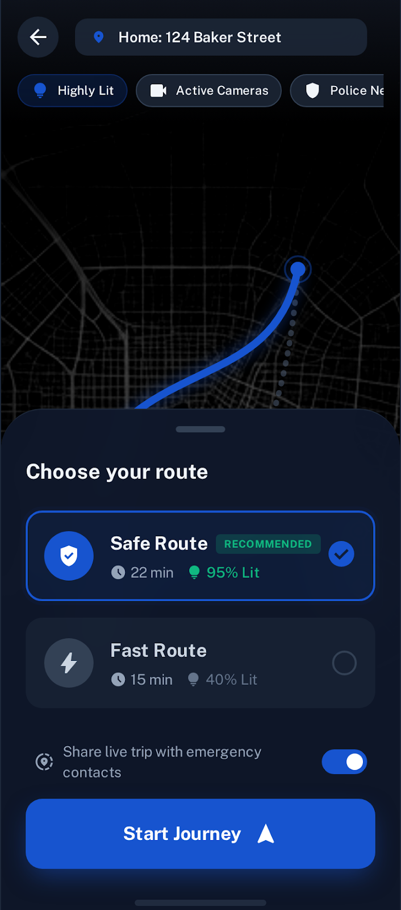
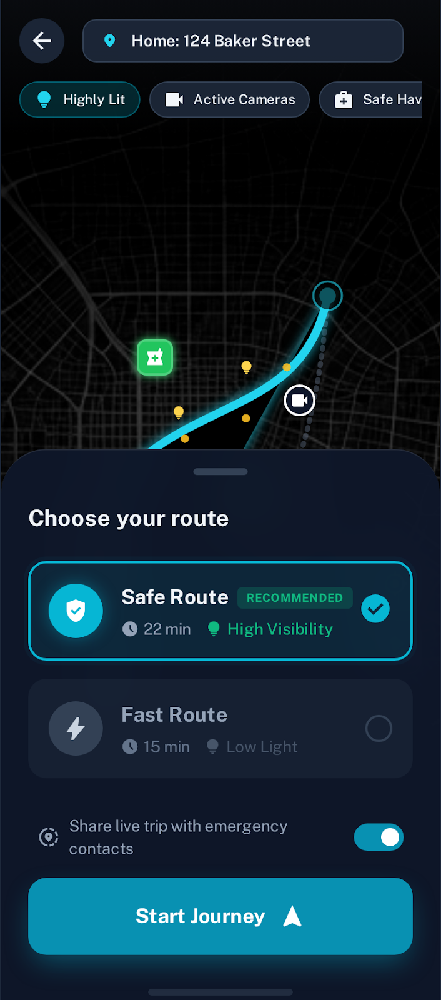

## 3. Modo Trayecto Activo (Navegación)
*   **3.1. Pantalla de Navegación Activa:**
    *   Mapa en movimiento siguiendo el GPS.
    *   Indicaciones de hacia dónde girar.
    *   **Botones flotantes de prevención:** "Botón del Pánico", "Llamada Falsa" y "Hombre Muerto".
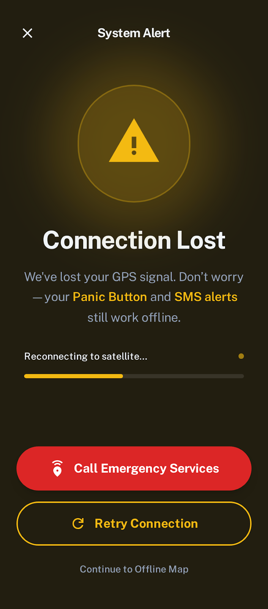
*   **3.2. Pantalla de Llamada Falsa (Simulador):** Interfaz idéntica a la llamada entrante nativa del sistema operativo (iOS/Android) con el nombre "Mamá" o similar. Al descolgar, muestra un temporizador de llamada activa.
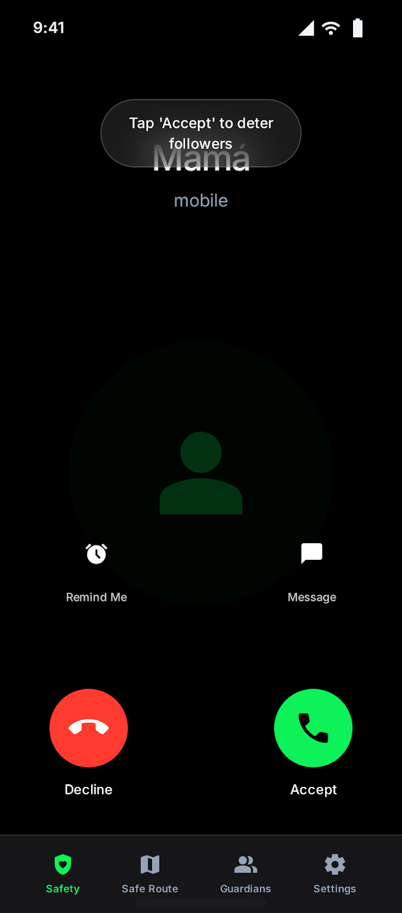
*   **3.3. Pantalla "Botón de Hombre Muerto":** Pantalla simplificada con un gran botón central (ej. una huella dactilar) que dice *"Mantén pulsado. Si sueltas, se activará la alarma"*.
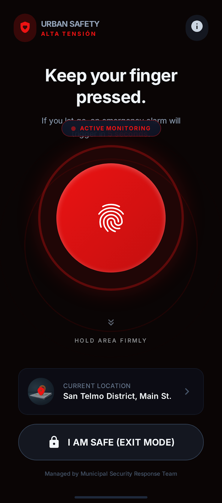
*   **3.4. Pop-up de Alerta de Desvío (Modo Monitor):** Pantalla superpuesta (overlay) que salta si hay una anomalía GPS. Mensaje: *"Hemos detectado un desvío. ¿Estás bien?"* con cuenta atrás de 15 segundos y botón para indicar "Sí, estoy bien" (pide PIN).
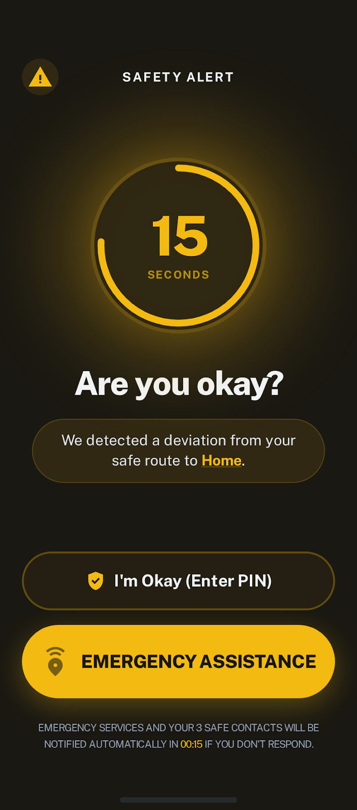

## 4. Comunidad y Encuentros
*   **4.1. Notificación \ Lista de Usuarias Cercanas:** Pequeño panel desplegable que muestra si hay mujeres cerca y botones de acción: "Llamar", "Mensaje", "Pedir acompañamiento".
*   **4.2. Chat Privado y Seguro:** 
    *   Interfaz de mensajería básica (texto).
    *   **Botón crucial:** "Denunciar usuario/conversación" (para enviar el log al servidor oficial).
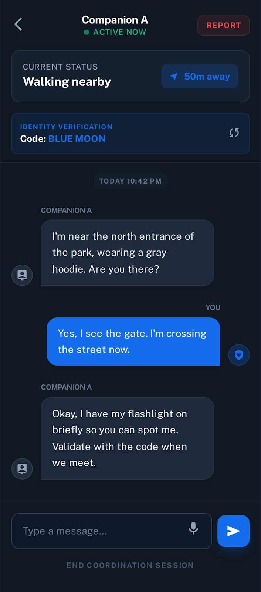
*   **4.3. Pop-up de Propuesta de Encuentro:** *"Hay una usuaria con tu misma ruta. ¿Deseas que os presentemos para ir juntas?"* (Botones: Sí / No).
*   **4.4. Pantalla de Validación (Santo y Seña):** Pantalla que aparece cuando dos usuarias aceptan encontrarse. Muestra un color sólido brillante en toda la pantalla o una palabra clave (ej. "MANZANA") en texto gigante para reconocerse físicamente.
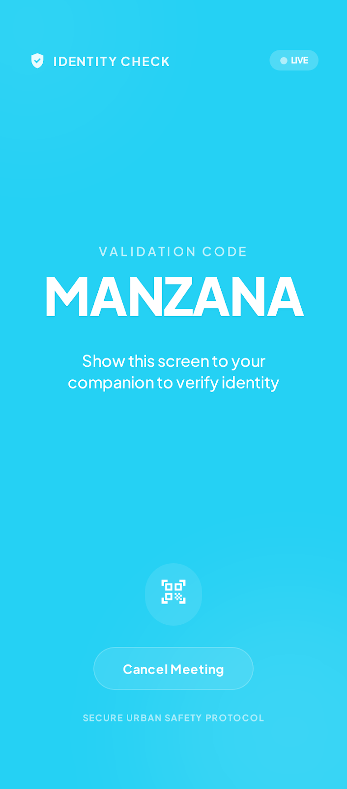

## 5. Emergencia y Botón del Pánico
*   **5.1. Cuenta Atrás de Pánico:** Pantalla roja parpadeante con un número gigante del 10 al 0. Botón de "Cancelar Alarma" debajo (que obligará a meter el PIN).
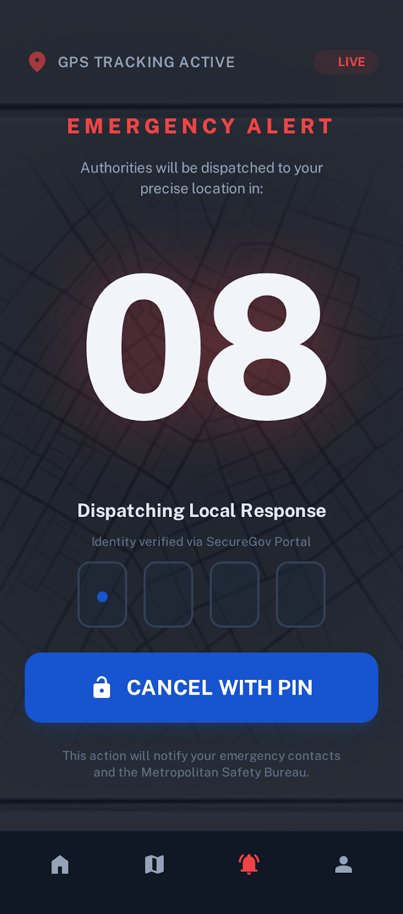
*   **5.2. Pánico Activo (Modo Grabación):** 
    *   La alarma ya se ha enviado. 
    *   La pantalla puede ponerse **negra** o mostrar una interfaz falsa para engañar al agresor.
    *   Internamente indica que se está grabando audio/vídeo cifrado y compartiendo la ubicación en vivo con la Policía/Familiares.
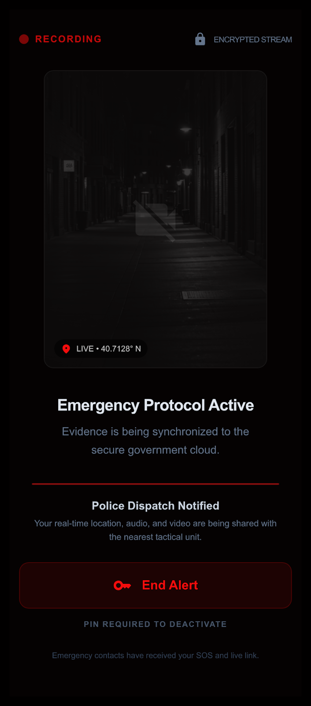
*   **5.3. Pantalla de Desactivación de Pánico:** Teclado numérico para introducir el PIN que detiene la alarma, la grabación y avisa de que el peligro ha pasado.
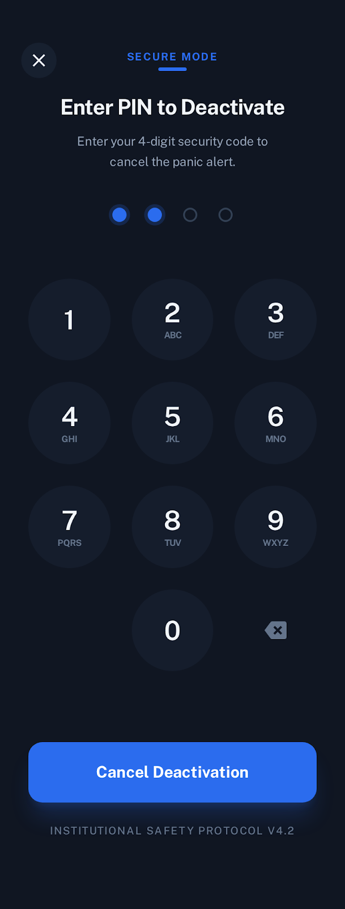

## 6. Fin de Trayecto y Participación Ciudadana
*   **6.1. Pantalla de Llegada Exitosa:** Animación de éxito. Mensaje: *"Has llegado a tu destino. Avisando a tus familiares..."*. (Esta pantalla destruye la ruta activa temporal).
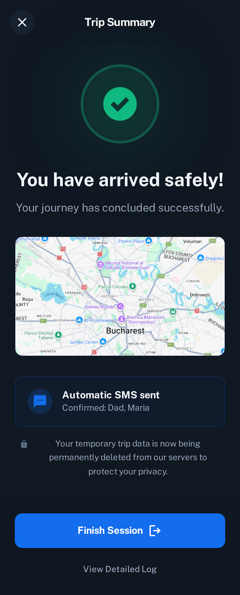
*   **6.2. Pantalla de Evaluación (Mapa de Calor):** 
    *   Pregunta: *"¿Qué tal tu ruta de hoy?"* (Caritas: Bien / Regular / Mal).
    *   Si elige Regular/Mal, pasa a un mapa donde puede dejar un **Pin de Reporte Anónimo** (Opciones: Poca luz, Grupo intimidante, Calle cortada, Zona solitaria). Botón: "Enviar reporte anónimo al Ayuntamiento".
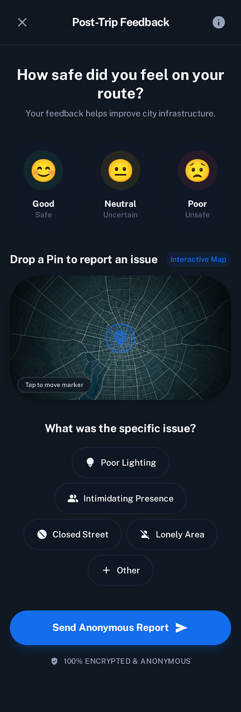

## 7. Configuración y Ajustes (Menú Lateral o Perfil)
*   **7.1. Mi Perfil Institucional:** Muestra el código de usuaria asignado (único dato).
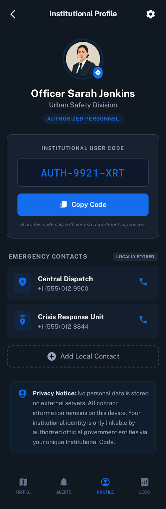
*   **7.2. Gestión de Familiares:** Para añadir, editar o borrar los números de teléfono para SMS automáticos.

*   **7.3. Configuración de Modo Camuflaje:** Selector para elegir cómo quiere que se camufle la app si activa el modo incógnito (Opciones: *Reproductor de Música, Calculadora, Feed de Noticias*).

*   **7.4. Ajustes de Hardware:** Activación\desactivación del pánico mediante pulsaciones del botón de encendido físico del móvil o por agitación del dispositivo.

*   **7.5. Pantalla de Camuflaje (Fake UI):** La interfaz falsa elegida (ej. una calculadora funcional) que esconde un gesto secreto (ej. mantener pulsado el símbolo "=") para volver a la app real o lanzar la alarma oculta.

